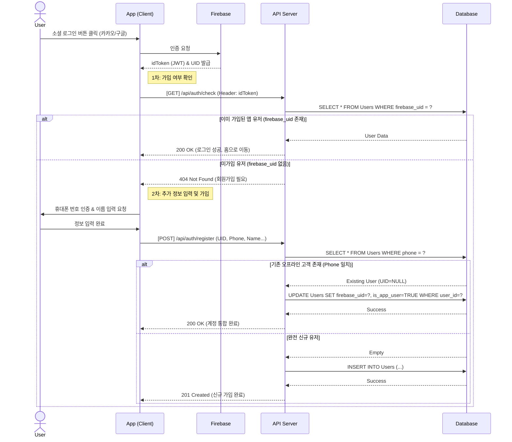
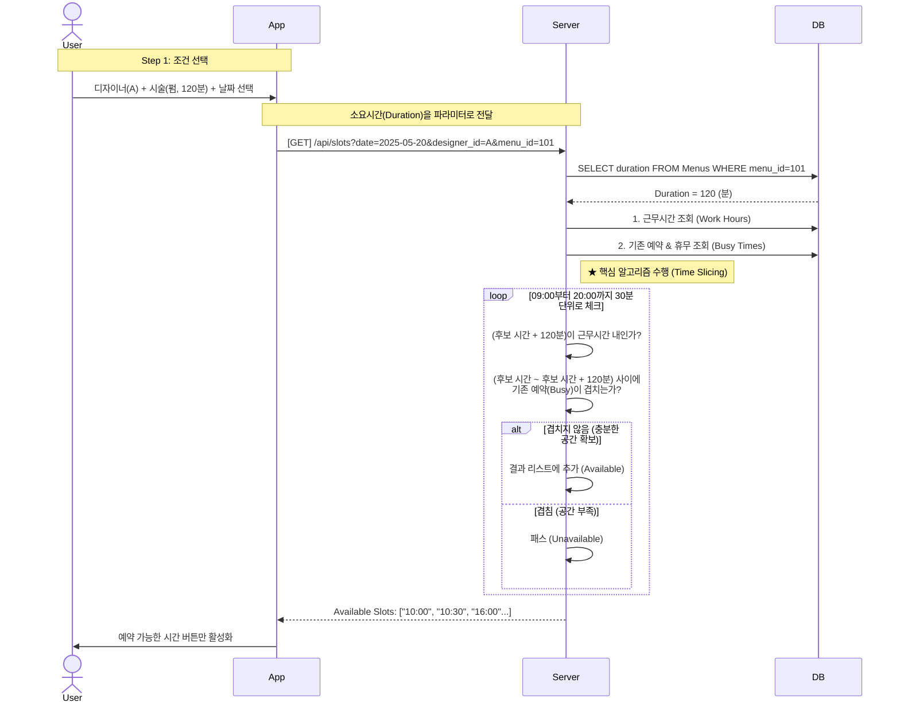
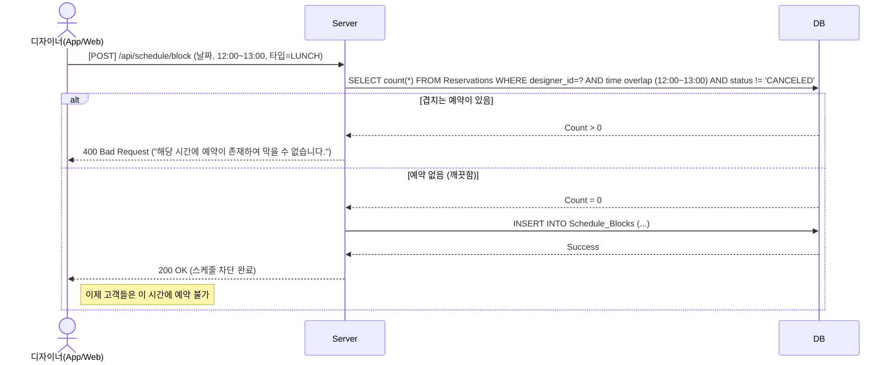

# 03. Sequence Diagrams

## 1. 회원가입 및 계정 통합 (Auth & Merge)
앱 가입 시 휴대폰 번호를 이용해 기존 오프라인 고객 데이터와 매칭하는 로직.
- 앱에서 Firebase 소셜 로그인을 완료한 후, 서버에 저장된 Users 테이블을 조회합니다.
- firebase_uid 가 없으면 신규 가입 절차로 넘어가며, 이때 phone 번호를 입력받아 기존 오프라인 고객 데이터와 매칭(DB Update) 하거나 신규 생성(DB Insert) 합니다.

## 2. 예약 가능 시간 조회 (Time Slot Calculation)
선택한 메뉴의 소요시간(Duration)을 고려하여 빈 시간을 찾는 로직.
- 사용자가 날짜와 디자이너를 선택하면, 서버는 **(1) 디자이너 근무시간 (2) 기존 예약 (3) 스케줄 블록(휴무)** 3가지를 고려하여 '예약 가능한 시간 슬롯'만 필터링해 줍니다.
- 이후 사용자가 슬롯을 선택하면 최종 예약을 생성합니다.

## 2. 디자이너 스케줄 관리 (Schedule Blocking)
디자이너나 원장이 점심시간, 개인 사정 등으로 특정 시간을 막으려 할 때(SCHEDULE_BLOCKS), 해당 시간에 이미 **확정된 예약(RESERVATIONS)**이 있는지 먼저 검증해야 합니다.

